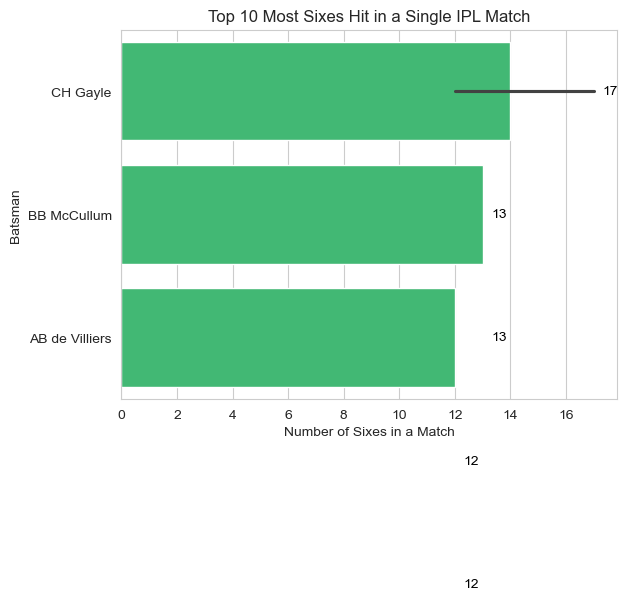

```python
import numpy as np
import pandas as pd
import seaborn as sns
import matplotlib.pyplot as plt
```


```python
df=pd.read_csv(r"C:\Users\yoges\Downloads\IPL Dataset.csv")
df.head()
```


<div>
<style scoped>
    .dataframe tbody tr th:only-of-type {
        vertical-align: middle;
    }

    .dataframe tbody tr th {
        vertical-align: top;
    }

    .dataframe thead th {
        text-align: right;
    }
</style>
<table border="1" class="dataframe">
  <thead>
    <tr style="text-align: right;">
      <th></th>
      <th>match_id</th>
      <th>season</th>
      <th>start_date</th>
      <th>venue</th>
      <th>innings</th>
      <th>ball</th>
      <th>batting_team</th>
      <th>bowling_team</th>
      <th>striker</th>
      <th>non_striker</th>
      <th>...</th>
      <th>runs_off_bat</th>
      <th>extras</th>
      <th>wides</th>
      <th>noballs</th>
      <th>byes</th>
      <th>legbyes</th>
      <th>wicket_type</th>
      <th>player_dismissed</th>
      <th>run</th>
      <th>over</th>
    </tr>
  </thead>
  <tbody>
    <tr>
      <th>0</th>
      <td>335982</td>
      <td>2008</td>
      <td>2008-04-18</td>
      <td>M.Chinnaswamy Stadium</td>
      <td>1</td>
      <td>0.1</td>
      <td>Kolkata Knight Riders</td>
      <td>Royal Challengers Bangalore</td>
      <td>SC Ganguly</td>
      <td>BB McCullum</td>
      <td>...</td>
      <td>0</td>
      <td>1</td>
      <td>0.0</td>
      <td>0.0</td>
      <td>0.0</td>
      <td>1.0</td>
      <td></td>
      <td></td>
      <td>1</td>
      <td>0</td>
    </tr>
    <tr>
      <th>1</th>
      <td>335982</td>
      <td>2008</td>
      <td>2008-04-18</td>
      <td>M.Chinnaswamy Stadium</td>
      <td>1</td>
      <td>0.2</td>
      <td>Kolkata Knight Riders</td>
      <td>Royal Challengers Bangalore</td>
      <td>BB McCullum</td>
      <td>SC Ganguly</td>
      <td>...</td>
      <td>0</td>
      <td>0</td>
      <td>0.0</td>
      <td>0.0</td>
      <td>0.0</td>
      <td>0.0</td>
      <td></td>
      <td></td>
      <td>0</td>
      <td>0</td>
    </tr>
    <tr>
      <th>2</th>
      <td>335982</td>
      <td>2008</td>
      <td>2008-04-18</td>
      <td>M.Chinnaswamy Stadium</td>
      <td>1</td>
      <td>0.3</td>
      <td>Kolkata Knight Riders</td>
      <td>Royal Challengers Bangalore</td>
      <td>BB McCullum</td>
      <td>SC Ganguly</td>
      <td>...</td>
      <td>0</td>
      <td>1</td>
      <td>1.0</td>
      <td>0.0</td>
      <td>0.0</td>
      <td>0.0</td>
      <td></td>
      <td></td>
      <td>1</td>
      <td>0</td>
    </tr>
    <tr>
      <th>3</th>
      <td>335982</td>
      <td>2008</td>
      <td>2008-04-18</td>
      <td>M.Chinnaswamy Stadium</td>
      <td>1</td>
      <td>0.4</td>
      <td>Kolkata Knight Riders</td>
      <td>Royal Challengers Bangalore</td>
      <td>BB McCullum</td>
      <td>SC Ganguly</td>
      <td>...</td>
      <td>0</td>
      <td>0</td>
      <td>0.0</td>
      <td>0.0</td>
      <td>0.0</td>
      <td>0.0</td>
      <td></td>
      <td></td>
      <td>0</td>
      <td>0</td>
    </tr>
    <tr>
      <th>4</th>
      <td>335982</td>
      <td>2008</td>
      <td>2008-04-18</td>
      <td>M.Chinnaswamy Stadium</td>
      <td>1</td>
      <td>0.5</td>
      <td>Kolkata Knight Riders</td>
      <td>Royal Challengers Bangalore</td>
      <td>BB McCullum</td>
      <td>SC Ganguly</td>
      <td>...</td>
      <td>0</td>
      <td>0</td>
      <td>0.0</td>
      <td>0.0</td>
      <td>0.0</td>
      <td>0.0</td>
      <td></td>
      <td></td>
      <td>0</td>
      <td>0</td>
    </tr>
  </tbody>
</table>
<p>5 rows × 21 columns</p>
</div>


```python
df.info()
```

    <class 'pandas.core.frame.DataFrame'>
    RangeIndex: 194354 entries, 0 to 194353
    Data columns (total 21 columns):
     #   Column            Non-Null Count   Dtype  
    ---  ------            --------------   -----  
     0   match_id          194354 non-null  int64  
     1   season            194354 non-null  int64  
     2   start_date        194354 non-null  object 
     3   venue             194354 non-null  object 
     4   innings           194354 non-null  int64  
     5   ball              194354 non-null  float64
     6   batting_team      194354 non-null  object 
     7   bowling_team      194354 non-null  object 
     8   striker           194354 non-null  object 
     9   non_striker       194354 non-null  object 
     10  bowler            194354 non-null  object 
     11  runs_off_bat      194354 non-null  int64  
     12  extras            194354 non-null  int64  
     13  wides             194354 non-null  float64
     14  noballs           194354 non-null  float64
     15  byes              194354 non-null  float64
     16  legbyes           194354 non-null  float64
     17  wicket_type       194354 non-null  object 
     18  player_dismissed  194354 non-null  object 
     19  run               194354 non-null  int64  
     20  over              194354 non-null  int64  
    dtypes: float64(5), int64(7), object(9)
    memory usage: 31.1+ MB
    

1.General Analysis of IPL Matches


```python
df.groupby(['venue','match_id']).count().droplevel(level=1).index.value_counts()
```


    venue
    M.Chinnaswamy Stadium                                   80
    Eden Gardens                                            77
    Arun Jaitley Stadium                                    74
    Wankhede Stadium, Mumbai                                74
    Rajiv Gandhi International Stadium, Uppal               64
    MA Chidambaram Stadium, Chepauk, Chennai                59
    Punjab Cricket Association IS Bindra Stadium, Mohali    56
    Sawai Mansingh Stadium                                  47
    Dubai International Cricket Stadium                     33
    Sheikh Zayed Stadium                                    29
    Maharashtra Cricket Association Stadium                 21
    Sharjah Cricket Stadium                                 18
    Dr DY Patil Sports Academy                              17
    Subrata Roy Sahara Stadium                              17
    Kingsmead                                               15
    Dr. Y.S. Rajasekhara Reddy ACA-VDCA Cricket Stadium     13
    SuperSport Park                                         12
    Sardar Patel Stadium, Motera                            12
    Brabourne Stadium                                       11
    Saurashtra Cricket Association Stadium                  10
    Holkar Cricket Stadium                                   9
    Himachal Pradesh Cricket Association Stadium             9
    New Wanderers Stadium                                    8
    JSCA International Stadium Complex                       7
    Barabati Stadium                                         7
    St George's Park                                         7
    Newlands                                                 7
    Shaheed Veer Narayan Singh International Stadium         6
    Nehru Stadium                                            5
    Green Park                                               4
    Buffalo Park                                             3
    Vidarbha Cricket Association Stadium, Jamtha             3
    De Beers Diamond Oval                                    3
    OUTsurance Oval                                          2
    Name: count, dtype: int64


Insight: The analysis shows most of the IPL matches were played in Chennai, Mumbai, Kolkata, Banglore, and Delhi.


```python
plt.figure(figsize=(10,8))
data = df.groupby(['match_id','season']).count().index.droplevel(level=0).value_counts().sort_index()
sns.barplot(y=data.index,x=data,orient='h')
plt.xlabel('Matches Played')
plt.ylabel('Season')
plt.show()
```


    

    


```python
data = df.groupby(['match_id', 'season']).count().index.droplevel(level=0).value_counts().sort_index()
ax = sns.barplot(y=data.index, x=data.values, orient='h',color='pink')

for i, v in enumerate(data.values):
    ax.text(v + 1, i, str(v), color='black', va='center')  # +1 to nudge text slightly right

plt.xlabel('Matches Played')
plt.ylabel('Season')
plt.title('IPL Matches Played')
plt.show()

```


    

    


Insight: Most IPl matches happened in 2013 with 76 matches played.


```python
bar_color = "#E63946"
data = df['bowling_team'].value_counts().sort_values(ascending=False)
ax = sns.barplot(y=data.index, x=data.values, orient='h', color=bar_color)


plt.xlabel('Matches Played')
plt.ylabel('Team')
plt.title('Matches Played by Each Team in IPL')
plt.show()

```


    

    


```python
Insight: Mumbai Indians playes most matches
```

2.IPL Batting Analysis


```python
bar_color = "#2A9D8F"
data = df.groupby(['batting_team'])['run'].sum().sort_values(ascending=False)
ax = sns.barplot(y=data.index, x=data.values, orient='h', color=bar_color)

plt.xlabel('Total Runs Scored')
plt.ylabel('Team')
plt.title('Most Run Scored by IPL Teams')
plt.show()

```


    

    


```python
bar_color = "#2ECC71"
data = df.groupby(['striker'])['runs_off_bat'].sum().sort_values(ascending=False)[:10]
ax = sns.barplot(y=data.index, x=data.values, orient='h', color=bar_color)

for i, v in enumerate(data.values):
    ax.text(v + 10, i, str(v), color='black', va='center')


plt.xlabel('Runs')
plt.ylabel('Batsman')
plt.title('Most IPL Runs by a Batsman')
plt.show()

```


    

    


Insight: Virat Kohli is at the top of this list with more than 6,000 runs followed by Suresh Raina and Shikhar Dhawan.


```python
df[df['over']<6].groupby(['match_id','batting_team']).sum()['run'].groupby('batting_team').mean().sort_values(ascending=False)[2:]
```


    batting_team
    Delhi Capitals                 48.176471
    Sunrisers Hyderabad            47.856000
    Rising Pune Supergiant         47.433333
    Kings XI Punjab                47.126316
    Kolkata Knight Riders          46.409326
    Delhi Daredevils               45.714286
    Deccan Chargers                45.560000
    Mumbai Indians                 45.529412
    Chennai Super Kings            45.195531
    Rajasthan Royals               44.912500
    Royal Challengers Bangalore    44.826531
    Pune Warriors                  42.111111
    Name: run, dtype: float64


Insight: Avg Run by a Teams in Powerplay.


```python
runs = df.groupby(['striker', 'match_id'])['runs_off_bat'].sum()
centuries = runs[runs >= 100].droplevel('match_id')
top_centuries = centuries.groupby('striker').count().sort_values(ascending=False)[:10]
sns.set_style("whitegrid")
sns.barplot(y=top_centuries.index, x=top_centuries.values, orient='h', color="#F4A261")

for i, v in enumerate(top_centuries.values):
    plt.text(v + 0.1, i, str(v), color='black', va='center')

plt.xlabel('Number of Centuries')
plt.ylabel('Batsman')
plt.title('Most IPL Century by a Player')
plt.show()

```


    

    


```python
Insight: Chris Gayle with 6 Centuries and follwed up wih Virat Kohli has most IPL Centuries.
```


```python
runs = df.groupby(['striker', 'start_date'])['runs_off_bat'].sum()
fifties = runs[runs >= 50].droplevel('start_date')
data = fifties.groupby('striker').count().sort_values(ascending=False).head(10)
ax = sns.barplot(y=data.index, x=data.values, orient='h', color=bar_color)

for i, v in enumerate(data.values):
    ax.text(v + 0.3, i, str(v), color='black', va='center')


plt.xlabel('Half-Centuries (50+ Scores)')
plt.ylabel('Batsman')
plt.title('Most IPL Fifty by Player')
plt.tight_layout()
plt.show()

```


    

    


Insight:  Warner is top in the list followed by Virat Kohli and Shikhar Dhawan.


```python
data = df.groupby(['season','striker'])['runs_off_bat'].sum().groupby('season').max()
temp_df=pd.DataFrame(df.groupby(['season','striker'])['runs_off_bat'].sum())
print("{0:10}{1:20}{2:30}".format("Season","Player","Runs"))
for season,run in data.items():
    player = temp_df.loc[season][temp_df.loc[season]['runs_off_bat'] == run].index[0]
    print(season,'\t ',player,'\t\t',run)
```

    Season    Player              Runs                          
    2008 	  SE Marsh 		 616
    2009 	  ML Hayden 		 572
    2010 	  SR Tendulkar 		 618
    2011 	  CH Gayle 		 608
    2012 	  CH Gayle 		 733
    2013 	  MEK Hussey 		 733
    2014 	  RV Uthappa 		 660
    2015 	  DA Warner 		 562
    2016 	  V Kohli 		 973
    2017 	  DA Warner 		 641
    2018 	  KS Williamson 		 735
    2019 	  DA Warner 		 692
    2020 	  KL Rahul 		 676
    2021 	  S Dhawan 		 85
    

Insight: The batsman with the most runs in the tournament during the course of the season would wear the Orange Cap while fielding, with the overall leading run-scorer at the conclusion of the tournament winning the actual Orange Cap award on the day of the season’s final.


```python
sixes = df[df['runs_off_bat'] == 6]
six_counts = sixes.groupby(['start_date', 'striker']).count()['season']
top_six_hitters = six_counts.sort_values(ascending=False).droplevel('start_date').head(5)
ax = sns.barplot(y=top_six_hitters.index, x=top_six_hitters.values, orient='h', color=bar_color)

for i, v in enumerate(top_six_hitters.values):
    ax.text(v + 0.3, i, str(v), color='black', va='center')

plt.xlabel('Number of Sixes in a Match')
plt.ylabel('Batsman')
plt.title('Top 10 Most Sixes Hit in a Single IPL Match')
plt.show()

```


    

    


Insight:Chris Gayle has hit the highest number of sixes in an inning with the number being 17 in the entire IPL history. Followed by Brendon McCullum and AB De Villiers.


```python
plt.figure(figsize=(10, 8))
data = df[df['runs_off_bat'] == 4]['striker'].value_counts().head(10)
ax = sns.barplot(y=data.index, x=data.values, orient='h', color=bar_color)

for i, v in enumerate(data.values):
    ax.text(v + 2, i, str(v), color='black', va='center')

plt.xlabel('Fours')
plt.ylabel('Batsman')
plt.title('Most Boundary (4s) hit by a Batsman')
plt.tight_layout()
plt.show()

```


    

    


Insight: Shikhar Dhawan is at the top of the list with more than 601 boundaries followed by Virat Kohli and David warner


```python
data = df.groupby(['striker', 'season'])['runs_off_bat'].sum().sort_values(ascending=False).head(10)
data.index = [f"{player} ({season})" for player, season in data.index]
bar_color = "#9B59B6"  
ax = sns.barplot(y=data.index, x=data.values, orient='h', color=bar_color)

for i, v in enumerate(data.values):
    ax.text(v + 5, i, str(v), color='black', va='center')

plt.xlabel('Total Runs')
plt.ylabel('Player (Season)')
plt.title('Most runs in an IPL season by Player')
plt.tight_layout()
plt.show()

```


    

    


Insight: Virat Kohli is at the top of the list with 973 runs in 2016 season followed by David Warner and Kane Williamson with 848 and 735 runs in the 2016 and 2018


```python
plt.figure(figsize=(10,8))
data = df[df['runs_off_bat'] == 6].groupby('season').count()['match_id'].sort_values(ascending=False)
sns.barplot(y=data.index,x=data,orient='h')
plt.title('Number of Sixes in IPl Season')
plt.xlabel('Sixes')
plt.ylabel('Season')
plt.show()
```


    

    


Insights: 2018 is the season with the most number of sixes hit. Followed by season 2019 and 2020 in the list of most sixes in a season.


```python
df.groupby(['start_date','batting_team']).sum()['run'].droplevel(level=0).sort_values(ascending=False)[:10]
```


    batting_team
    Royal Challengers Bangalore    263
    Royal Challengers Bangalore    248
    Chennai Super Kings            246
    Kolkata Knight Riders          245
    Chennai Super Kings            240
    Royal Challengers Bangalore    235
    Kolkata Knight Riders          232
    Kings XI Punjab                232
    Delhi Daredevils               231
    Sunrisers Hyderabad            231
    Name: run, dtype: int64


```python

```


```python
team_scores = df.groupby(['start_date', 'batting_team'])['run'].sum()
top_scores = team_scores.droplevel('start_date').sort_values(ascending=False).head(10)
bar_color = "#F39C12"
ax = sns.barplot(y=top_scores.index, x=top_scores.values, orient='h', color=bar_color)


for i, v in enumerate(top_scores.values):
    ax.text(v + 5, i, str(v), color='black', va='center')


plt.xlabel('Runs Scored')
plt.ylabel('Team')
plt.title('Highest Total by IPL Teams')

plt.show()

```


    

    


Insight: Royal Challengers Bangalore is at the top of the list of highest run by a team. The match was played against Pune Warrior in the 2019 season.


```python
df['start_date'] = pd.to_datetime(df['start_date'])
data = df.groupby(['striker', 'start_date'])['runs_off_bat'].sum().sort_values(ascending=False).head(10)
data.index = [f"{player} ({date.date()})" for player, date in data.index]
sns.set_style("whitegrid")
bar_color = "#8E44AD"
ax = sns.barplot(y=data.index, x=data.values, orient='h', color=bar_color)


for i, v in enumerate(data.values):
    ax.text(v + 3, i, str(v), color='black', va='center')


plt.xlabel('Runs Scored')
plt.ylabel('Batsman (Match Date)')
plt.title(' Highest Individual IPL Score by Batsman')
plt.show()

```


    

    


Insight:Chris Gayle playing against Pune Warrior has hit the highest individual score in the 2013 season. Brendon McCullum and Ab de Villiers are in the second and third positions on the list.

3. Bowling Statistics


```python
df['start_date'] = pd.to_datetime(df['start_date'])
data = df.groupby(['bowler', 'start_date'])['run'].sum().sort_values(ascending=False).head(10)
data.index = [f"{bowler} ({date.date()})" for bowler, date in data.index]
ax = sns.barplot(y=data.index, x=data.values, orient='h', color=bar_color)

for i, v in enumerate(data.values):
    ax.text(v + 2, i, str(v), color='black', va='center')

plt.xlabel('Runs Conceded')
plt.ylabel('Bowler (Match Date)')
plt.title('Most Runs Conceded by a Bowler in an IPL Match')
plt.show()

```


    

    


Insight: Basil Thampi playing for SRH against RCB in the 2008 season has conceded 70 runs


```python
dismissal_types = ['caught', 'bowled', 'lbw', 'stumped', 'caught and bowled', 'hit wicket']
filtered_df = df[df['wicket_type'].isin(dismissal_types)]
top_bowlers = filtered_df['bowler'].value_counts().head(10)

sns.set_style("whitegrid")
plt.figure(figsize=(10, 6))
ax = sns.barplot(x=top_bowlers.index, y=top_bowlers.values, color=bar_color)


for i, v in enumerate(top_bowlers.values):
    ax.text(i, v + 0.1, str(v), color='black', ha='center')

plt.xlabel('Bowlers')
plt.ylabel('Number of Dismissals')
plt.title('Top Wicket Taking Bowlers')
plt.show()
```


    

    


Insight: Srilankan bowler Malinga is at the top of the list with 170 wickets followed by Amit Mishra and Push Chawla with 160 and 156 wickets respectively.


```python
plt.figure(figsize=(10,8))
lst = 'caught,bowled,lbw,stumped,caught and bowled,hit wicket'
data = df[df['wicket_type'].apply(lambda x: True if x in lst and x != ' ' else False)]['bowling_team'].value_counts()
df.groupby(['batting_team'])['extras'].agg('sum').sort_values(ascending=False)
sns.barplot(y=data.index,x=data,orient='h')
plt.title('Most Wickets by an IPL Team')
plt.xlabel('Wickets')
plt.ylabel('Teams')
plt.show()
```


    

    


```python
Insight: The Mumbai Indian has taken the most number of wickets in IPL followed by Royal Challengers Banglore and Chennai Super Kings
```


```python

```


```python

```


```python

```


```python

```
